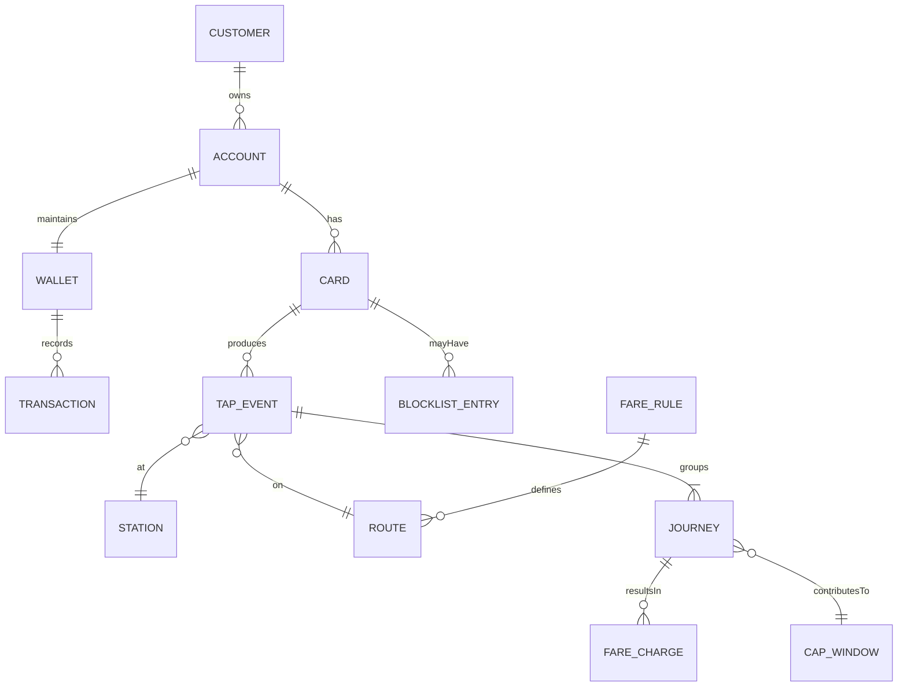

# Oyster-Style Travel System (Scala Play) – Design Case Study

## Scope & Goals
- Enable customers to create an account, order a physical contactless card, and receive it by mail.
- Support top-ups and auto top-ups; maintain a wallet balance.
- Validate taps on buses (single tap) and trains (tap-in/out) in real time; allow travel if balance >= minimum hold amount.
- Calculate fares, caps, and discounts; settle final charges at journey completion or cap boundary.
- Provide admin/ops tools for card lifecycle (issue, replace, block), revenue reporting, dispute handling, and auditing.

## Functional Requirements
- Account management: signup/login, KYC, address capture, card ordering, replacement, and blocklist.
- Wallet: add payment instrument, top-up, refunds, transaction ledger, low-balance notifications, auto top-up rules.
- Travel validation:
  - Bus: one-tap validation, immediate provisional fare (flat) or minimum hold, offline list of blocked cards.
  - Train: tap-in reserves a hold; tap-out finalizes fare based on route/station pairs and applies caps.
  - Handle missing tap-out via maximum fare and auto-adjustments when late tap is received.
- Fare & caps: peak/off-peak rules, daily/weekly caps, concessions, travelcards/passes, delay refunds.
- Operations: hot-list propagation to validators, card shipment tracking, reconciliation with payment gateway, revenue & SLA dashboards.

## Non-Functional Requirements
- Availability: ≥99.9% for validation APIs; degraded-but-safe mode for validators (offline hotlist + local hold rules).
- Latency: <150 ms P95 for tap validation; <2 s end-to-end fare computation for multi-leg trips.
- Scalability: horizontal scale on stateless API nodes; event-driven fare engine; partitioning by cardId.
- Security: PCI scope minimization (tokenized payments), encrypted PAN/token at rest, signed validator-to-gateway calls, audit logs.
- Observability: structured logs, trace IDs per tap, metrics (latency, denies, fallbacks), SLO alerts.

## High-Level Architecture (HLD)

```mermaid
flowchart LR
  subgraph Edge
    Client[Web/Mobile/Validator Gate] --> API[API Gateway\nAuthN/Z, rate limit, WAF]
  end

  API --> Auth[Auth Service (Play)\nOAuth2/JWT]
  API --> Account[Account & Card Service (Play)\nprofiles, addresses, card lifecycle]
  API --> Wallet[Wallet & Billing Service (Play)\nledger, balance, top-ups]
  API --> Travel[Travel Event Intake (Play)\n/validateTap]

  Account --> PG[(PostgreSQL\ncustomers, cards, addresses)]
  Wallet --> Ledger[(Ledger DB)\ntransactions, balances]
  Travel --> Bus[(Validator Cache/Redis)\nhotlist, fare params]
  Travel --> Q[(Event Bus e.g., Kafka)]

  Q --> Fare[Streaming Fare Engine\nstateful consumers]
  Fare --> TripState[(Redis/Scylla)\nopen journeys, holds]
  Fare --> Caps[(Capping DB)]
  Fare --> Ledger
  Fare --> Notify[Notification Service]
  Notify --> Comm[(Email/SMS/Push)]

  Wallet --> PayGW[(Payment Gateway)]
  Account --> Mailer[(Card Fulfillment/Shipment)]
  Admin[Admin UI] --> API
```

### Service Responsibilities (Scala Play)
- **API Gateway**: terminates TLS, JWT verification, rate limiting, request signing for validators.
- **Auth Service**: user auth, OAuth2/JWT issuance for clients and validator devices.
- **Account & Card Service**: customer profiles, addresses, card ordering workflow, card status (active, blocked, replaced), hotlist feeds.
- **Wallet & Billing Service**: maintains ledger and available balance, processes top-ups/refunds, auto top-up scheduler, integrates with payment gateway (tokenized cards).
- **Travel Event Intake**: synchronous validation endpoint for taps; applies fast path rules (balance check, hotlist, minimum hold), enqueues events to fare engine.
- **Fare Engine**: stateful stream processor computing fares, caps, and adjustments; reconciles missing taps; writes charges/refunds to ledger; emits notifications.
- **Notification Service**: email/SMS/push for shipment, low balance, charges, disputes.
- **Admin UI/API**: manual adjustments, disputes, reports, validator fleet management, fare configuration.

## Data Model (ERD)



Key attributes (examples):
- `CUSTOMER(id, name, email, phone, kyc_status)`
- `ACCOUNT(id, customer_id, status, created_at)`
- `CARD(id, account_id, card_token, status, expiry, validator_key_id)`
- `WALLET(id, account_id, balance, currency, auto_top_up_rule_id)`
- `TRANSACTION(id, wallet_id, type, amount, reference, fare_charge_id?, status, created_at)`
- `TAP_EVENT(id, card_id, station_id?, route_id?, device_id, direction[in|out], ts, validator_seq)`
- `JOURNEY(id, card_id, tap_in_id, tap_out_id?, mode[bus|train], inferred_route_id?, status)`
- `FARE_CHARGE(id, journey_id, rule_id, amount, cap_window_id?, adjustment_type)`
- `CAP_WINDOW(id, card_id, window_type[daily|weekly], period_start, period_end, accrued_amount)`
- `FARE_RULE(id, mode, peak_flag, origin_id?, destination_id?, amount, max_fare, cap_amount, concession_type)`

## Key Flows
- **Card Order**: User signs up → provides address → selects card type → payment for issuance (if any) → fulfillment service creates shipment → card status `SHIPPED` → activation on receipt.
- **Top-Up**: User adds payment instrument → calls `/wallet/topup` → gateway capture → ledger credit → balance increases; auto top-up rules run via scheduler.
- **Bus Tap (online)**: Validator sends signed `/validateTap` with cardId → gateway checks hotlist + balance ≥ flat fare (or hold) → respond allow/deny + auth code → event queued → fare engine posts final charge to ledger; offline uses cached hotlist and holds.
- **Train Tap**: Tap-in reserves hold (minimum fare) and opens journey in TripState; tap-out closes journey, selects best route, applies caps, posts delta charge/refund; if no tap-out before TTL, apply max fare then adjust if later evidence arrives.
- **Cap Computation**: Fare engine aggregates FARE_CHARGE into CAP_WINDOW; when cap reached, subsequent charges zeroed or discounted.
- **Dispute/Adjustment**: Admin creates correction transaction → ledger entry with reference to journey/charge; notifications sent.

## Validator/Gate Considerations
- Local caches: hotlist, fare tables, minimum hold amounts; periodic signed updates.
- Request signing and device certificates to prevent spoofing; clock sync required.
- Degraded mode: allow travel with conservative rules (e.g., deny if balance < threshold; apply max fare later).
- Offline tap batching with sequence numbers to prevent replay.

## Deployment & Operations
- Stateless Play services behind a load balancer; blue/green or canary releases.
- Separate data stores: PostgreSQL for relational data; Redis/Scylla for journey state; Kafka for events; object storage for audit logs.
- Backups and PITR for PostgreSQL and ledger; GDPR/PII handling with field-level encryption.
- Observability dashboards: tap latency, deny reasons, cap hits, open journeys > SLA, reconciliation mismatches.

## Testing Strategy
- Unit tests for fare rules and capping logic (table-driven).
- Contract tests for validator `/validateTap` API (including offline envelopes).
- Integration tests with embedded Play server + PostgreSQL testcontainer.
- Property tests for journey reconstruction from unordered tap streams.
- Load tests focusing on tap validation P95 and fare engine throughput.

## Deliverables Checklist (what to build next)
- Play services: Auth, Account/Card, Wallet, Travel Intake, Fare Engine.
- Admin UI for operations and fare configuration.
- CI/CD with migrations, contract tests, and canary deploy hooks.
- Runbooks for hotlist rollout, fare changes, and incident response.
