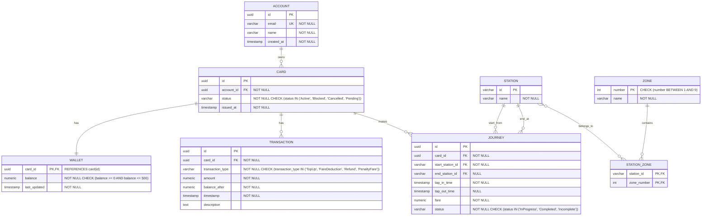

# Entity Relationship Diagram (ERD)

## Oyster Travel System - Database Schema

This document describes the entity relationship diagram for the Oyster Travel System database.

## 🎯 WHITEBOARD VERSION - Quick Draw Guide

**For Interview Presentations:**

```
SIMPLIFIED SYSTEM VIEW:
======================

HTTP Client → Play API → Services → Database

LAYERS:
-------
1. API Layer:     Controllers (REST endpoints)
2. Service Layer: Business logic (AccountService, CardService, etc.)
3. Data Layer:    PostgreSQL database

CORE ENTITIES (Draw 4 boxes):
-----------------------------
┌─────────┐     ┌──────┐     ┌────────┐     ┌─────────┐
│ ACCOUNT │────▶│ CARD │────▶│ WALLET │     │ JOURNEY │
└─────────┘     └───┬──┘     └────────┘     └────┬────┘
                    │                             │
                    └─────────────────────────────┘
                           transactions

RELATIONSHIPS:
--------------
• ACCOUNT → CARD    (1:Many)  "One account has many cards"
• CARD → WALLET     (1:1)     "Each card has one wallet"
• CARD → TRANSACTION (1:Many) "Card has many transactions"
• CARD → JOURNEY    (1:Many)  "Card makes many journeys"
• STATION ↔ ZONE    (Many:Many) "Stations span zones"

KEY TABLES:
-----------
1. ACCOUNT   (id, email, name, created_at)
2. CARD      (id, account_id, status, issued_at)
3. WALLET    (card_id, balance, last_updated)
4. TRANSACTION (id, card_id, type, amount, timestamp)
5. JOURNEY   (id, card_id, start_station, end_station, fare, status)
6. STATION   (id, name)
7. ZONE      (number, name)

API ENDPOINTS (Key ones to mention):
-------------------------------------
POST /api/accounts         - Create account
POST /api/cards            - Order card
POST /api/wallets/topup    - Add money
POST /api/tap/in           - Start journey
POST /api/tap/out          - End journey
GET  /api/monitoring/stats - View statistics
```

## ERD Diagram



## System Architecture with Play Framework API

```
┌──────────────────────────────────────────────────┐
│          HTTP CLIENTS (Web/Mobile/CLI)           │
└────────────────────┬─────────────────────────────┘
                     │ HTTP/REST
                     ▼
┌──────────────────────────────────────────────────┐
│         PLAY FRAMEWORK API LAYER                 │
│  Controllers:                                    │
│  • AccountController  → AccountService           │
│  • CardController     → CardService              │
│  • WalletController   → WalletService            │
│  • TapController      → TapValidationService     │
│  • MonitoringController → MonitoringService      │
└────────────────────┬─────────────────────────────┘
                     │ Service Layer
                     ▼
┌──────────────────────────────────────────────────┐
│          BUSINESS SERVICES LAYER                 │
│  • AccountService  • WalletService               │
│  • CardService     • TapValidationService        │
└────────────────────┬─────────────────────────────┘
                     │ Repository Pattern
                     ▼
┌──────────────────────────────────────────────────┐
│              DATA LAYER                          │
│         Database: PostgreSQL                     │
│  Tables: ACCOUNT, CARD, WALLET, TRANSACTION,     │
│          JOURNEY, STATION, ZONE, STATION_ZONE    │
└──────────────────────────────────────────────────┘
```

## Entity Descriptions

### ACCOUNT
Represents a customer account in the system.
- **id**: Unique identifier (UUID)
- **email**: Customer email address (unique, required)
- **name**: Customer full name (required)
- **created_at**: Account creation timestamp

### CARD
Represents a physical or virtual travel card.
- **id**: Unique identifier (UUID)
- **account_id**: Reference to the owning account (required)
- **status**: Current card status (Active, Blocked, Cancelled, Pending)
- **issued_at**: Card issuance timestamp

### WALLET
Stores the monetary balance for each card.
- **card_id**: Reference to the card (one-to-one relationship)
- **balance**: Current balance in pounds (0 to 500)
- **last_updated**: Last modification timestamp

### TRANSACTION
Records all financial transactions.
- **id**: Unique identifier (UUID)
- **card_id**: Reference to the card
- **transaction_type**: Type of transaction (TopUp, FareDeduction, Refund, PenaltyFare)
- **amount**: Transaction amount
- **balance_after**: Balance after transaction (audit trail)
- **timestamp**: When the transaction occurred
- **description**: Human-readable description

### JOURNEY
Tracks travel journeys from tap-in to tap-out.
- **id**: Unique identifier (UUID)
- **card_id**: Reference to the card used
- **start_station_id**: Station where journey began
- **end_station_id**: Station where journey ended (NULL if incomplete)
- **tap_in_time**: When passenger tapped in
- **tap_out_time**: When passenger tapped out (NULL if in progress)
- **fare**: Actual fare charged
- **status**: Journey status (InProgress, Completed, Incomplete)

### STATION
Represents transport stations in the network.
- **id**: Unique station identifier (string)
- **name**: Human-readable station name

### ZONE
Represents transport zones (1-9).
- **number**: Zone number (1-9)
- **name**: Zone name (e.g., "Zone 1")

### STATION_ZONE
Junction table for many-to-many relationship between stations and zones.
- **station_id**: Reference to station
- **zone_number**: Reference to zone
- Composite primary key (station_id, zone_number)

## Relationships

1. **ACCOUNT to CARD**: One-to-Many
   - One account can have multiple cards
   - Each card belongs to exactly one account

2. **CARD to WALLET**: One-to-One
   - Each card has exactly one wallet
   - Each wallet belongs to exactly one card

3. **CARD to TRANSACTION**: One-to-Many
   - One card can have multiple transactions
   - Each transaction is associated with one card

4. **CARD to JOURNEY**: One-to-Many
   - One card can make multiple journeys
   - Each journey is made with one card

5. **STATION to JOURNEY**: One-to-Many (for both start and end)
   - Each station can be the start/end of multiple journeys
   - Each journey has one start station and optionally one end station

6. **STATION to ZONE**: Many-to-Many
   - Stations can span multiple zones (e.g., Earl's Court in Zone 1 and 2)
   - Zones contain multiple stations

## Indexes

Recommended indexes for query performance:

```sql
-- Primary key indexes (created automatically)
-- Additional indexes for foreign keys and common queries:

CREATE INDEX idx_card_account_id ON card(account_id);
CREATE INDEX idx_card_status ON card(status);
CREATE INDEX idx_transaction_card_id ON transaction(card_id);
CREATE INDEX idx_transaction_timestamp ON transaction(timestamp);
CREATE INDEX idx_journey_card_id ON journey(card_id);
CREATE INDEX idx_journey_status ON journey(status);
CREATE INDEX idx_journey_start_station ON journey(start_station_id);
CREATE INDEX idx_journey_end_station ON journey(end_station_id);
CREATE INDEX idx_journey_tap_in_time ON journey(tap_in_time);
CREATE INDEX idx_account_email ON account(email);
```

## Database Constraints

### Check Constraints
- **card.status**: Must be one of 'Active', 'Blocked', 'Cancelled', 'Pending'
- **wallet.balance**: Must be between 0 and 500
- **transaction.transaction_type**: Must be one of 'TopUp', 'FareDeduction', 'Refund', 'PenaltyFare'
- **journey.status**: Must be one of 'InProgress', 'Completed', 'Incomplete'
- **zone.number**: Must be between 1 and 9

### Referential Integrity
- All foreign keys have ON DELETE RESTRICT to prevent orphaned records
- Exception: journey.end_station_id allows NULL for incomplete journeys

### Business Rules Enforced at Database Level
1. Email addresses must be unique across accounts
2. Balance cannot be negative or exceed £500
3. Card status transitions must be valid
4. Journey must have a start station
5. Completed journeys must have an end station and tap-out time
